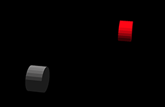
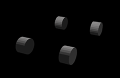

# svg THREE D model
Easily convert your svg images into 3D models,
you'll be needing two svg images corresponding respectively to the front and the side of your model.
Solids on the same plane need to be grouped by colour, please refrain from using the `<style>` tag, 
use instead the `fill` attribute on every path.  
For instance the following  

  

renders  

  
  
whereas the following  

  

renders  

  

## Usage
install node and clone the repository, to install the dependencies open your terminal and run:

```
npm install
```

now run

```
npm run serve
```

open your browser and go to [http://127.0.0.1:8080](http://127.0.0.1:8080) then choose your images 
(should you not have some at hand use the ones in the svg folder) and take it for a spin  

-- made with THREE.js


